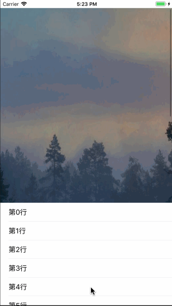

## TGHeaderView
###一句代码搞定UITableView headerview 下拉放大 上滑遮盖的效果
# GIF


### 自定义的headerview
```
    CustomHeaderView *hederView = [CustomHeaderView shareCustomHeaderView];
    hederView.frame = CGRectMake(0, 0, self.view.frame.size.width, 300);
    self.headerView = hederView;
```
### 一句代码集成
```
    self.tableView.tableHeaderView = [TGHeaderView loadSetupForCustomSubView:hederView HeaderViewWithSize:hederView.size];

```
### 滑动
```
- (void)scrollViewDidScroll:(UIScrollView *)scrollView{
    [((TGHeaderView *)_tableView.tableHeaderView) layoutHeaderViewForScrollViewOffset:scrollView.contentOffset];
}

```
